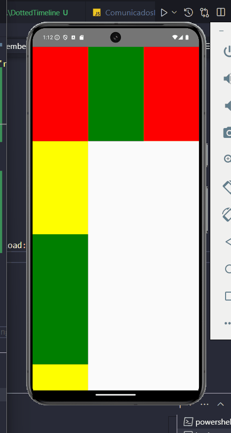

# Preview da visualiza��o atual da tela:

* Aplicando grupo de estilos:

* Tamanhos fixos e dinâmicos:

* Finalizando aula:

* Flexbox e alinhamento:

* Recebedo dados e fazendo redem com useState

* useState trabalhando com botões:

* Scrollview vertical e horizontal:

* FlatList

* instalando picker no react-native:
* `npm install @react-native-picker/picker --save`

* Implementando e usando picker:

* Instalando o slider no react-native:
`npm install @react-native-community/slider --save`

* Implementando e usando slider:

* Usando switch:

* Criando modais:

* Criando Modal por meio de outro component:
